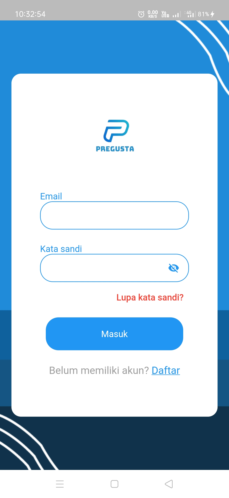
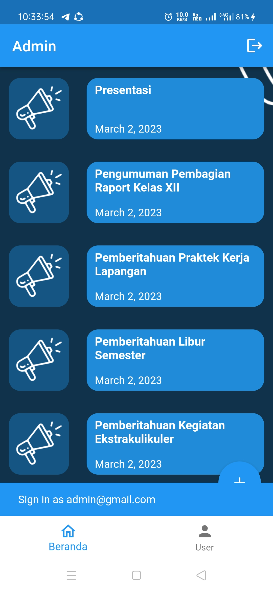
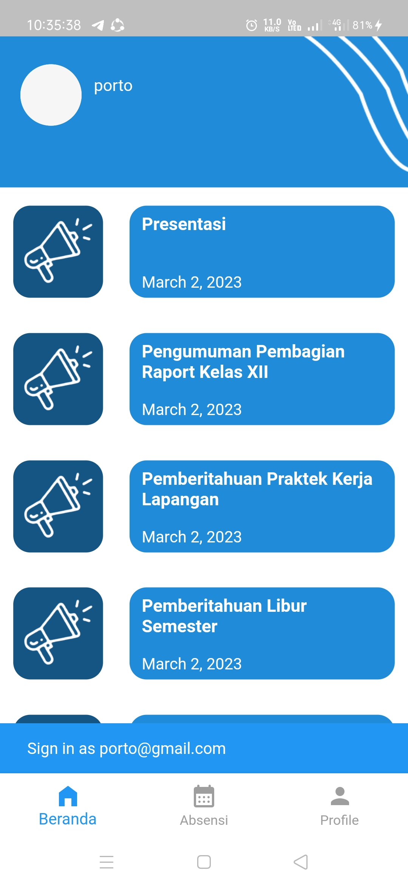
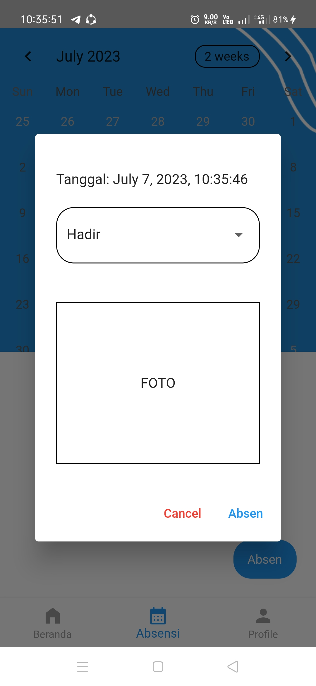
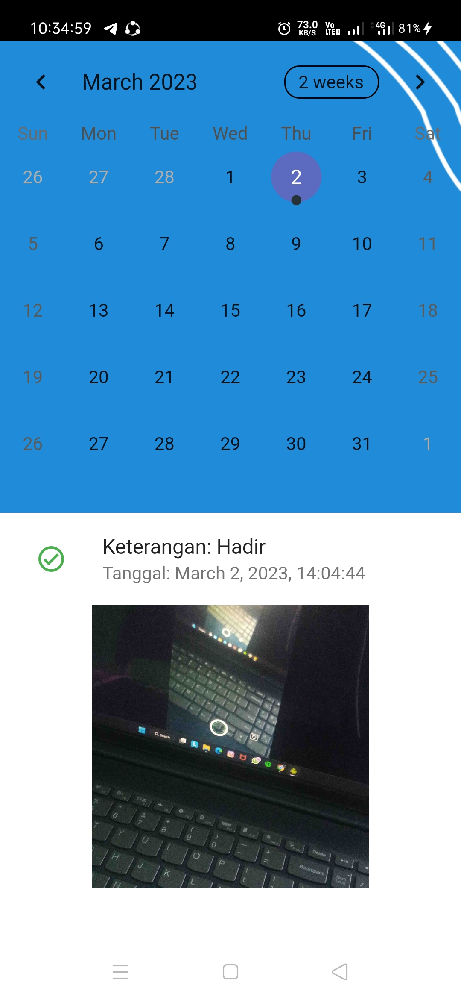
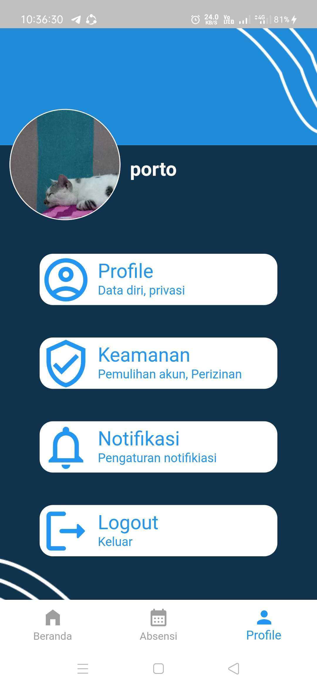
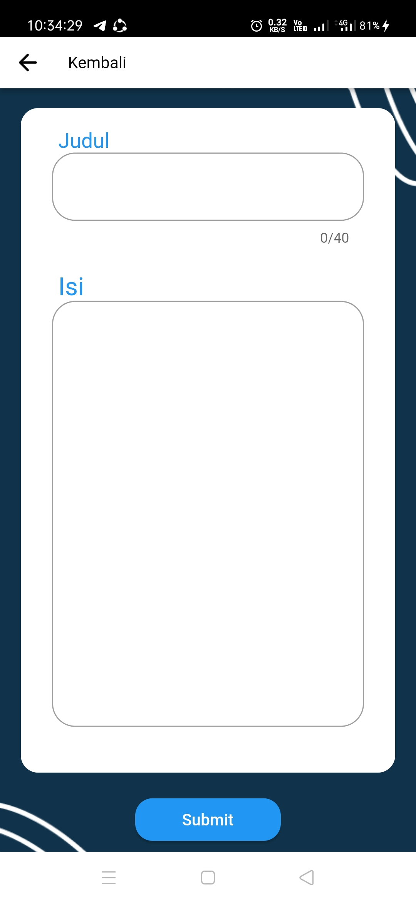

# Pregusta

## Description
Pregusta is an app to recap attendance and share announcement.

## Feature
- Authentication
- Add attendance
- Check user attendance
- Change profile (name, profile picture, etc)
- Add announcement
- Set notifications for attendance reminders

## Screenshot

| Login        | Register    | Admin        | User    |
|--------------|-----------|-------|----|
|  |  |  | |
| Add Attendance        | User Attendance    | Profile        | Add Announcement    |
|  |  |  | |

## What i use
- Firebase auth, storage, and firestore
- Local storage (Shared Preferences)
- And other libraries from https://pub.dev/
